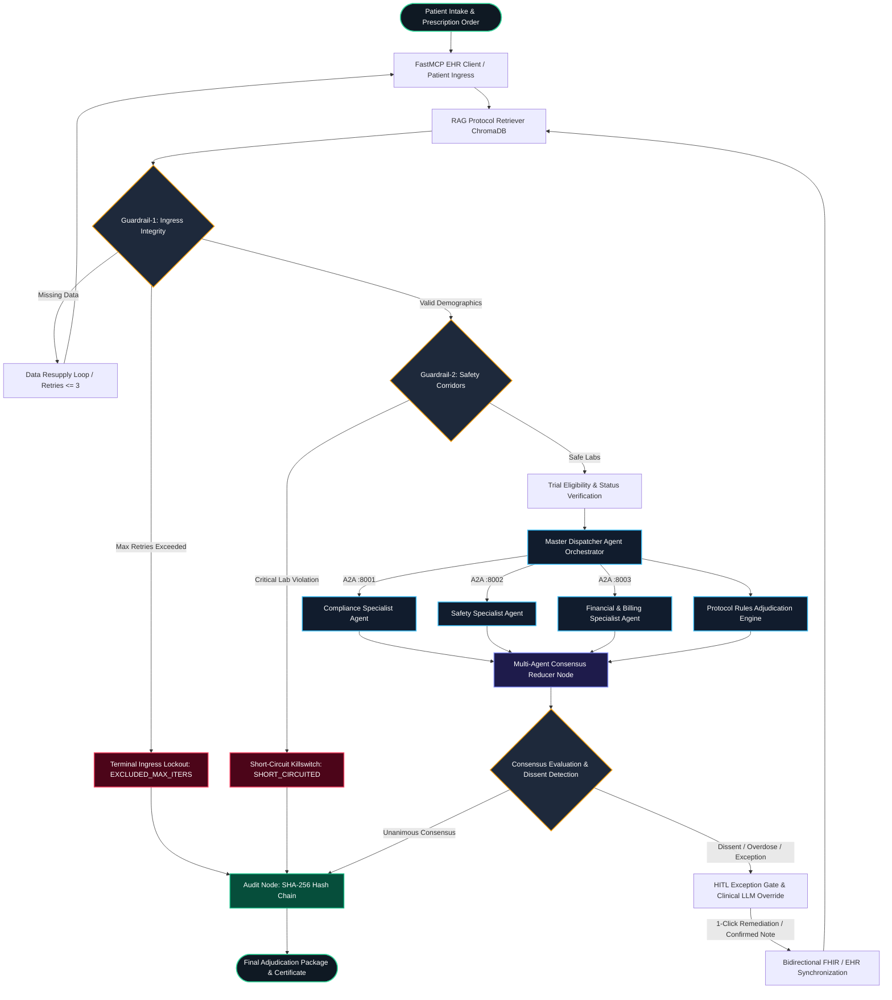

<div align="center">

# TrialGuard
### Agentic Point-of-Care Validation for Clinical Trials

[](https://github.com/google/a2a)
[](https://github.com/langchain-ai/langgraph)
[](https://modelcontextprotocol.io)
[](https://nextjs.org)
[](https://reactflow.dev)
[](#audit-trail--regulatory-alignment)
[](https://python.org)

<p align="center">
  When a researcher proposes a mid-trial dose change, TrialGuard checks protocol compliance, patient safety, and financial impact, then records what the system advised and what the human decided.
</p>

</div>

>  Research prototype. TrialGuard is a proof of concept built and tested on open-source protocol documents and synthetic patient data. It is not a medical device, has not been clinically validated, and must not be used to make real treatment decisions.

---

## Table of Contents

1. [The Problem](#the-problem)
2. [What TrialGuard Does](#what-trialguard-does)
3. [A Simple Example](#a-simple-example)
4. [Why an Agentic Approach](#why-an-agentic-approach)
5. [Architecture](#architecture)
6. [Key Design Decisions](#key-design-decisions)
7. [Core Features](#core-features)
8. [Tech Stack](#tech-stack)
9. [Existing Alternatives](#existing-alternatives)
10. [User Research](#user-research)
11. [Implementation Status](#implementation-status)
12. [Installation & Setup](#installation--setup)
13. [Running TrialGuard](#running-trialguard)
14. [Evaluator Walkthrough](#evaluator-walkthrough)
15. [Test Patient Matrix](#test-patient-matrix)
16. [Audit Trail & Regulatory Alignment](#audit-trail--regulatory-alignment)
17. [Limitations & Future Work](#limitations--future-work)
18. [Troubleshooting](#troubleshooting)
19. [References](#references)
20. [Team & Acknowledgements](#team--acknowledgements)

---

## The Problem

When a researcher, nurse, or doctor wants to change a patient's dose during an ongoing trial, they need answers to three questions:

1. Protocol: is the new dose still within what the protocol allows?
2. Safety: is it safe for *this* patient?
3. Cost: how does it affect the trial's budget?

Today these answers usually come from memory, or from different people and systems, one piece at a time. Afterward there is no record of whether advice was sought, what was said, or whether it was followed.

The evidence suggests this gap is real:

| Finding | Source |
|:---|:---|
| Clinicians override medication alerts roughly 46–96% of the time. One tertiary-hospital study measured 92.2%, and 13% of those overrides had no audited reason | [1], [2] |
| A typical Phase III trial has around 119 protocol deviations, affecting about a third of patients | [3] |
| Monitoring for such problems can consume 15–30% of a trial's total budget | [4] |
| The industry-standard risk tool (TransCelerate RACT) is completed once, usually in a spreadsheet, before the trial starts and is not revisited as decisions happen | [5] |
| A 2026 shared task showed risky dosing patterns are measurable at scale, but it remains a research benchmark rather than a deployed tool | [6] |

Our thesis: agent apps can move protocol, safety, and financial checks from something *discovered after a decision is made* to something *checked at the moment of decision*, and can turn every human override of that check into a recorded, accountable event instead of an invisible one.

---

## What TrialGuard Does

TrialGuard steps in at one moment, for one proposed action at a time:

1. A researcher submits a proposed dose change for a patient in a trial.
2. The system pulls the patient's history (FHIR) and the relevant protocol (RAG, keyed by Trial ID).
3. Deterministic guardrails check data integrity and hard safety limits before any LLM is called.
4. Cases that pass fan out to three independent specialist agents (Compliance, Safety, Financial) over the A2A protocol, running in parallel.
5. A consensus reducer merges their verdicts and detects dissent.
6. A human-in-the-loop gate lets the researcher Accept, Reject, or Modify.
7. Every agent output and human decision is written to a tamper-evident audit trail.

Who uses it

- Researchers and investigators get advice *before* they act.
- Trial leadership can see which researchers accepted or overrode the system's advice, and how often.

---

## A Simple Example

A trial protocol caps Apixaban at 5 mg twice daily. A researcher proposes 40 mg twice daily for a patient.

- The Compliance Agent retrieves the protocol clause and returns `NON_COMPLIANT`: the dose exceeds the 5 mg cap.
- The Safety Agent reads this patient's labs and history and flags patient-specific risk.
- The Financial Agent checks the proposed order against structured billing data and reports coverage and cost exposure.

The reducer combines these into one recommendation: `NOT_JUSTIFIED`, with a suggested compliant alternative. The researcher can accept the suggestion, reject it and keep the original order, or modify the plan to something in between. Whatever they choose is logged, so anyone reviewing the trial later can see exactly what was recommended and what actually happened.

---

## Why an Agentic Approach

Three reasons drove the choice of agents over a simple rule checker:

1. Protocols are unstructured. Eligibility criteria, safety limits, and dosing rules are written in natural language. Converting them into rigid if-then rules is fragile and means rewriting code whenever a protocol changes. TrialGuard instead treats the protocol as a knowledge source: it is parsed, chunked, embedded, and stored in a vector database. At query time the most relevant clauses are retrieved by semantic similarity and passed to the LLM, which reasons over them alongside the patient's data.

2. The decision needs three kinds of judgment at once. In practice these questions go to three different people: *is it safe, does it follow the rules, what does it cost?* Splitting the work across three focused agents running in parallel mirrors how a hospital actually does it, in seconds instead of days.

3. A2A keeps the system modular. Specialist agents are independent services that talk to the master agent over a standard protocol, so they can be built, tested, and swapped without disrupting the pipeline. The architecture also keeps the human in charge: the agents report trade-offs, and the researcher makes the final call.

---

## Architecture

```
       [ EMR / FHIR Ingress ]
                 │
   ┌─────────────▼─────────────┐
   │ Guardrail-1: Schema/Demo  │ ──(Missing Data)──> [ Self-Healing Resupply Loop ]
   └─────────────┬─────────────┘
                 │ (Passed)
   ┌─────────────▼─────────────┐
   │ Guardrail-2: Safety Floor │ ──(Life-Threatening)─> [ SHORT-CIRCUIT KILLSWITCH ]
   └─────────────┬─────────────┘
                 │ (Passed)
   ┌─────────────▼─────────────┐
   │ Master Dispatcher Fan-Out │
   └──────┬───────────┬────────┘
          │           │
 ┌────────▼─────┐ ┌───▼──────────┐ ┌─────────────▼┐
 │  Compliance  │ │    Safety    │ │  Financial   │  <== A2A microservices
 │  Specialist  │ │  Specialist  │ │  Specialist  │      (Ports 8001-8003)
 └────────┬─────┘ └───┬──────────┘ └─────────────┬┘
          │           │                          │
          └───────────┼──────────────────────────┘
                      ▼
        [ Multi-Agent Consensus Reducer ]
                      │
            (Dissent / Overdose)
                      ▼
   ┌─────────────────────────────────────┐
   │ HITL Exception Gate & Clinical LLM  │
   │  - Free-Text Doctor Note Extraction │
   │  - Fuzzy Spelling Typo Correction   │
   │  - 1-Click Protocol Remediation     │
   │  - Bi-Directional FHIR Sync         │
   └──────────────────┬──────────────────┘
                      │
                      ▼
          [ SHA-256 Hash-Chained Audit ]
```

### Full LangGraph flow



### Flow in words

A researcher submits a proposed action and patient identifier through the Next.js dashboard to a FastAPI gateway in front of the LangGraph orchestrator. The orchestrator first fetches the patient's history from the FHIR MCP server, then sends the history and proposed action to the RAG MCP service, which uses the Trial ID to pull the relevant protocol out of a ChromaDB vector store. After the guardrails, the master agent dispatches the case to the three A2A specialists, and each sends its answer back to the same master agent, which merges them into one recommendation. A Modify decision loops back to the orchestrator for re-analysis; Accept and Reject both save the full record as evidence of what happened.

### Monorepo structure

```
trialguard/
├── apps/
│   ├── web/                     # Next.js 16 Command Center (React 19, @xyflow/react, Tailwind v4)
│   ├── gateway/                 # FastAPI Central Gateway & Ingress Router (:8000)
│   ├── agent-compliance/        # Protocol Compliance Agent Microservice (:8001, A2A)
│   ├── agent-safety/            # Clinical Safety Specialist Microservice (:8002, A2A)
│   ├── agent-financial/         # Financial & Billing Specialist Microservice (:8003, A2A)
│   ├── agent_master/            # A2A Master Client & Dispatcher
│   └── orchestrator/            # LangGraph State Machine, Nodes, Edges & Report Engine
├── packages/
│   ├── mcp-ehr/                 # FastMCP FHIR R4 Server & Patient Fixtures
│   ├── mcp-rag/                 # Protocol Retrieval Integration Stubs
│   ├── mcp-audit/               # Audit Trail Helpers (hash chain)
│   └── shared-schemas/          # Pydantic & TypeScript Data Models
├── services/
│   └── rag_service/             # ChromaDB Vector Store & Embedding Pipelines
├── scripts/
│   └── seed_comprehensive_patients.py # 17 Synthetic Patient Verification Fixtures
├── start_all.py                 # Multi-Service Process Orchestrator & Streamer
├── batch_audit.py               # Headless CLI Batch Adjudication Runner
├── visualize_graph.py           # LangGraph Topology Visualizer (ASCII, Mermaid, PNG)
├── pyproject.toml               # Python Workspace Monorepo Configuration
├── package.json                 # Turborepo Node.js Monorepo Configuration
└── .env.example                 # Environment Variables Template
```

---

## Key Design Decisions

### Grounding each specialist agent

Each agent is constrained to a specific, checkable source rather than an open-ended prompt.

- Protocol Compliance retrieves verbatim clauses from the trial protocol through the RAG service using explicit Trial-ID metadata filtering. It checks whether a proposed dose escalation or frequency change aligns with the phase schedule and dose-modification rules, and cites the exact page for each detected deviation.
- Patient Safety is given dedicated structured fields (age, weight, kidney and liver lab results, and so on) so it can flag risks specific to *this* patient instead of giving generic advice. It also evaluates drug-drug interactions and toxicity corridors.
- Financial & Billing does not let the LLM estimate costs, and does not pull numbers out of a free-text budget document through RAG, where context mixing makes mistakes more likely. It reads a structured cost sheet (cost per extra visit, per lab panel, per unit of drug) and applies trial billing policies to determine coverage and patient out-of-pocket exposure, with an explanation.

### Context isolation

Each specialist only sees what it needs. The Safety agent receives structured EHR data and the proposed action (no protocol text); the Compliance agent receives protocol rules and the action (no patient history).

- Independent opinions. In a single monolithic prompt, an agent that sees both datasets can be biased by one against the other, for example inventing safety concerns simply because a protocol is strict. Isolation keeps each assessment independent before consensus.
- Parallel execution. Because the agents do not depend on each other, the master agent fans out all three concurrently. Latency is bounded by the *slowest* agent, not the sum of all three.

### Deterministic before probabilistic

Hard clinical limits are enforced in code before any LLM inference. The LLM never gets a vote on catastrophic cases, and no tokens are spent on them.

### The human stays in charge

The system advises; the researcher decides. Modify exists because clinical decisions are rarely binary.

---

## Core Features

#### 1. A2A Distributed Specialist Consensus
Instead of a single monolithic prompt, clinical reasoning is split across independent microservices communicating over the Agent-to-Agent (A2A) protocol via HTTP / JSON-RPC 2.0 (`a2a.sendMessage`):
* Protocol Compliance Agent (`:8001`): trial arms, dosing intervals, inclusion criteria.
* Safety Specialist Agent (`:8002`): drug-drug interactions, toxicity corridors, adverse events.
* Financial & Billing Agent (`:8003`): sponsor budget coverage, CMS/Medicare clinical-trial billing policies, patient out-of-pocket exposure.

#### 2. Two-Tier Ingress Guardrails
* Guardrail-1 (schema hygiene & self-healing resupply loop): validates demographic and clinical integrity (DOB, biological sex, vital signs, trial mapping). If data is missing, it triggers an automated Data Resupply Loop that re-queries the FastMCP EHR endpoints up to `MAX_REFINEMENT_ITERATIONS=3`. If the budget is exhausted, the patient is permanently locked out (`EXCLUDED_MAX_ITERS`).
* Guardrail-2 (deterministic catastrophic safety corridors): evaluates life-threatening contraindications (e.g. eGFR < 15 mL/min, Total Bilirubin > 5x ULN, ANC < 500/µL, intracranial hemorrhage) before any LLM call, and triggers an instant Short-Circuit Killswitch (`SHORT_CIRCUITED`).

#### 3. Hybrid RAG Protocol Knowledge Engine
Combines semantic vector search (ChromaDB + sentence-transformers) with deterministic protocol-parameter enforcement. Protocol documents (antithrombotic, oncology, SGLT2i renal, NAFLD/MASH) are parsed, chunked, and indexed per trial.

#### 4. Multi-Agent Consensus Reducer
Gathers specialist verdicts, calculates weighted confidence vectors, detects dissenting opinions, and applies deterministic conflict resolution to reach a final verdict: `JUSTIFIED`, `NOT_JUSTIFIED`, or `REQUIRES_HITL`.

#### 5. HITL Exception Gate & Bidirectional FHIR Sync
When a protocol deviation or overdose occurs:
* Free-text note extraction: a clinical LLM parses the physician's narrative note into a structured order.
* Fuzzy typo normalization: misspelled drug names are corrected (e.g. `"apixiban"` to `Apixaban`).
* Conversational filtering: vague or non-clinical notes trigger a `Clinical Warning: Inappropriate or Ambiguous Doctor Note` banner and block submission until resolved.
* 1-click protocol remediation: one click normalizes a non-compliant dose to the protocol-compliant ceiling.
* Bidirectional writeback: validated updates are synchronized to in-memory registries, local JSON fixtures, and (optionally) Supabase.

#### 6. Tamper-Evident Audit Trail
Every agent execution, consensus decision, and physician override is chained with SHA-256 hashes, producing an audit certificate and exportable PDF/JSON reports. See [Audit Trail & Regulatory Alignment](#audit-trail--regulatory-alignment).

#### 7. Command Center UI with Live ReactFlow Telemetry
Built on Next.js 16, React 19, and `@xyflow/react` v12, with memoized custom nodes and real-time Server-Sent Events (SSE) streaming so the multi-agent execution graph updates live without canvas jitter.

---

## Tech Stack

| Layer | Technology | Role |
|:---|:---|:---|
| Backend listener | FastAPI | Gateway the dashboard talks to |
| Orchestration | LangGraph | Stateful workflow: guardrails, HITL checkpoint, Modify loop, case hand-off |
| Agent communication | A2A protocol | Lets the master agent discover and call the three specialists |
| Tool access | FastMCP (MCP) | Standard interface for patient data (FHIR server) and protocol data (RAG service) |
| Retrieval | RAG + ChromaDB | Pulls the right protocol text by Trial ID and combines it with patient data |
| Persistence | Supabase *(optional)* | Cloud storage for patient data and audited decisions; falls back to local storage |
| Frontend | Next.js 16, React 19, ReactFlow | Researcher-facing dashboard and live graph |
| LLM providers | Gemini / OpenAI / Groq | At least one required, with automatic fallback between providers |

---

## Existing Alternatives

We found no existing tool that combines protocol-specific compliance, patient-specific safety, and cost impact into a single recommendation with an audited override trail.

| Tool | Domains | Frequency | Audit trail |
|:---|:---|:---|:---|
| Hospital CDS alerts | Safety only | Point-of-care | Dropdown reason code |
| TransCelerate RACT [5] | Protocol complexity & operational risk | Once, at design | None |
| CluePoints [7] | Data / safety statistics | Periodic / post-hoc | Batch (site-level) |
| TrialGuard | Safety, protocol, financial | Point-of-care, per action | Full decision log |

- Hospital CDS alerts focus on general formulary interactions, not trial-specific investigational protocols, and override tracking is typically a dismissive dropdown without a verifiable rationale.
- TransCelerate RACT evaluates risk across several categories but is a static checklist at protocol design, not an active system during execution.
- CluePoints performs centralized statistical surveillance across sites, retrospectively. It does not parse protocol semantics or evaluate individual point-of-care actions.

---

## User Research

To test the operational viability and clinical fit of the idea, we ran discovery interviews with seven practitioners across clinical research, pharmacovigilance, and medicine (names in [Acknowledgements](#team--acknowledgements)). Three recurring findings shaped the product:

1. Point-of-care gap validated. Even when protocol rules and patient safety are both considered, they are rarely available *together* at the moment a dosage change is decided. Checking both at once makes the decision faster, more consistent, and easier to justify under a complex protocol.
2. Autonomy and nuance ("Modify"). Clinical decisions are rarely binary, and a Modify option is valued for preserving clinical judgment. Practitioners also warned that the tool would be ignored, like routine hospital alerts, if its recommendations are verbose or fire on obviously low-risk cases. This motivated the concise, page-cited rationale display.
3. Audit trail value vs. burden. Practitioners strongly supported logging overrides together with rationales, so retrospective audits can show that deviations were deliberate rather than arbitrary. They also stressed that the documentation step must stay lightweight and fast to avoid adding administrative overhead.

---

## Implementation Status

Every claim in this project is labelled as implemented, simulated, or assumed.

| Type | Description |
|:---|:---|
| Implemented | End-to-end pipeline: FastAPI gateway, LangGraph orchestration, A2A exchange, RAG (ChromaDB, Trial-ID-keyed), FHIR MCP server, guardrails, consensus reducer, HITL gate, hash-chained audit logging, ReactFlow dashboard |
| Simulated | Open-source protocol documents; synthetic FHIR patient dataset (17 profiles) |
| Assumed | That accumulated Accept / Reject / Modify records would give trial leadership a materially different view of researcher behavior than they have today |

The pipeline is designed to run on an organization's own protocol documents and a real FHIR dataset without architectural changes. The substitutions above reflect what data was available to us, not a limit of the pipeline.

---

## Installation & Setup

### Prerequisites

* OS: macOS (Apple Silicon or Intel), Linux (Ubuntu 20.04+ / Debian 11+), or Windows 11 with WSL2
* Memory / disk: 8 GB RAM minimum (16 GB recommended for concurrent LLM streaming), 3 GB free disk space
* Python: 3.11 or higher (`python3 --version`)
* Node.js: 20.x LTS or 22.x LTS (`node --version`)
* `uv` (Python workspace manager):
  ```bash
  curl -LsSf https://astral.sh/uv/install.sh | sh
  ```
* `pnpm`:
  ```bash
  npm install -g pnpm@12.3.4
  ```
* At least one LLM API key: [Google Gemini](https://aistudio.google.com/) (default), [OpenAI](https://platform.openai.com/), or [Groq](https://console.groq.com/)
* *(Optional)* Supabase URL and key for cloud persistence. If omitted, TrialGuard falls back to in-memory and local-disk storage.

### Step 1: Clone

```bash
git clone https://github.com/<your-username>/<your-repo>.git
cd <your-repo>
```

### Step 2: Python dependencies

```bash
uv sync
```

<details>
<summary>Alternative: plain pip setup</summary>

```bash
python3 -m venv .venv
source .venv/bin/activate  # On Windows: .venv\Scripts\activate
pip install -r requirements.txt
pip install -e packages/shared-schemas
pip install -e packages/mcp-ehr
pip install -e apps/gateway
pip install -e apps/orchestrator
pip install -e apps/agent-compliance
pip install -e apps/agent-safety
pip install -e apps/agent-financial
pip install -e apps/agent_master
```
</details>

### Step 3: Frontend dependencies

```bash
pnpm install
```

### Step 4: Configure environment

```bash
cp .env.example .env
```

Edit `.env`:

```ini
# LLM providers (provide at least one valid key)
GEMINI_API_KEY=your_gemini_api_key_here
GEMINI_MODEL=gemini-2.5-flash
GEMINI_FALLBACK_MODELS=gemini-2.0-flash,gemini-1.5-flash

# Alternatively or concurrently:
OPENAI_API_KEY=your_openai_api_key_here
GROQ_API_KEY=your_groq_api_key_here
GROQ_MODEL=llama-3.3-70b-versatile

# Microservice ports and A2A endpoints (defaults for localhost)
GATEWAY_PORT=8000
COMPLIANCE_FASTAPI_PORT=8001
SAFETY_FASTAPI_PORT=8002
FINANCIAL_FASTAPI_PORT=8003

A2A_COMPLIANCE_URL=http://127.0.0.1:8001/a2a
A2A_SAFETY_URL=http://127.0.0.1:8002/a2a
A2A_FINANCIAL_URL=http://127.0.0.1:8003/a2a

# Max iterations for the Guardrail-1 self-healing resupply loop
MAX_REFINEMENT_ITERATIONS=3

# Optional Supabase (falls back to local JSON if blank)
SUPABASE_URL=
SUPABASE_SERVICE_ROLE_KEY=
NEXT_PUBLIC_SUPABASE_URL=
NEXT_PUBLIC_SUPABASE_ANON_KEY=
```

> Never commit your `.env` file or API keys.

### Step 5: Seed synthetic patients

```bash
uv run python scripts/seed_comprehensive_patients.py
```
Expected output: `✓ Seeded 17 comprehensive synthetic clinical trial patients into local fixtures.`

---

## Running TrialGuard

### Method 1: One command (recommended)

```bash
python3 start_all.py
```

This boots all five services with color-coded, multiplexed logs:

```
==============================================================
  Starting TrialGuard Ecosystem (5 Services)
    - COMPLIANCE   -> http://localhost:8001
    - SAFETY       -> http://localhost:8002
    - FINANCIAL    -> http://localhost:8003
    - GATEWAY      -> http://localhost:8000
    - WEB          -> http://localhost:3000
==============================================================
```

Open http://localhost:3000. Press `Ctrl + C` to stop everything; the launcher traps `SIGINT`/`SIGTERM` and shuts down child processes cleanly.

### Method 2: Individual services (separate terminals)

```bash
uv run python apps/agent-compliance/server.py   # Terminal 1, :8001
uv run python apps/agent-safety/server.py       # Terminal 2, :8002
uv run python apps/agent-financial/server.py    # Terminal 3, :8003
uv run python apps/gateway/main.py              # Terminal 4, :8000
pnpm --filter @techquest/web dev                # Terminal 5, :3000
```

### Method 3: Headless batch audit

```bash
uv run python batch_audit.py
```

```
==========================================================================
  TRIALGUARD BATCH ADJUDICATION AUDIT: 17 PROFILES (NCT02415400)
==========================================================================

PID    | Name                   | Verdict    | Conf   | HITL   | Violations
------------------------------------------------------------------------
P034   | Sunita Rao             | JUSTIFIED  | 0.98   | False  | 0
P036   | Michael Chang          | NOT_JUST   | 0.92   | True   | 1
P038   | Ananya Deshmukh        | EXCLUDED   | 1.00   | False  | 1
P039   | Robert Chen            | EXCLUDED   | 1.00   | False  | 1
P041   | Elena Rostova          | SHORT_CIRC | 1.00   | False  | 1
P042   | Marcus Vance           | SHORT_CIRC | 1.00   | False  | 1
P043   | Priya Patel            | SHORT_CIRC | 1.00   | False  | 1
```

### Method 4: Visualize the LangGraph topology

```bash
uv run python visualize_graph.py
```
Outputs an ASCII graph in the terminal, `orchestrator_graph.mmd` (Mermaid), and `orchestrator_graph.png`.

### Verification commands

```bash
# Web build validation (TypeScript + Next.js)
pnpm --filter @techquest/web build

# Agent microservice contract tests
uv run python apps/agent-compliance/test_compliance.py
uv run python apps/agent-safety/test_safety.py
uv run python apps/agent-financial/test_financial.py

# Health endpoints
curl -s http://localhost:8000/health | grep '"status":"ok"'
curl -s http://localhost:8001/health | grep '"status":"healthy"'
curl -s http://localhost:8002/health | grep '"status":"healthy"'
curl -s http://localhost:8003/health | grep '"status":"healthy"'
```

---

## Evaluator Walkthrough

At http://localhost:3000, these flows show each design decision in action.

#### 1. Standard compliant patient (unanimous approval)
Select preset P034 (Sunita Rao), order `Apixaban 5 mg oral twice daily`, click Start Adjudication. The patient passes Guardrail-1 and Guardrail-2 (CrCl 68 mL/min > 30 mL/min threshold), the three agents run in parallel, and the reducer returns `JUSTIFIED` with full sponsor coverage and a SHA-256 audit certificate.

#### 2. Guardrail-1 failure and self-healing lockout
Select P038 (missing biological sex) or P039 (missing age). The system runs the Data Resupply Loop up to 3 times, then permanently excludes the patient (`Patient ID Permanently Excluded (3/3 Retries Exhausted)`) and locks the submit button.

#### 3. Guardrail-2 pre-inference short-circuit
Select P041 (eGFR 12 < 15), P042 (Total Bilirubin 6.8 mg/dL > 5x ULN), or P043 (ANC 320/µL < 500). The pipeline fires the Short-Circuit Killswitch with no LLM tokens spent, bypasses the specialists, and goes straight to the audit log.

#### 4. Protocol overdose, 1-click remediation, and FHIR sync
Select P036 (Michael Chang), order `Apixaban 40 mg oral twice daily` (limit is 5 mg BID). The Compliance Agent returns `NON_COMPLIANT`, the reducer returns `NOT_JUSTIFIED`, and the HITL Exception Drawer opens with a `1-Click Fix to Standard` button. Click it, then Confirm & Update FHIR Database; the graph re-evaluates and flips to `JUSTIFIED`.

#### 5. Free-text clinical note with typo correction
Open the Modify Dosage / Override drawer and enter:
> *"Patient exhibits stable renal function (CrCl 72 mL/min). Titrate apixiban to 5mg bid per protocol Arm A."*

Click Evaluate Note via Clinical LLM. The system shows `Spelling Corrected: "apixiban" -> Apixaban` and builds a structured FHIR payload (5 mg, oral, twice daily, every 12 hours, target `MedicationRequest.dosageInstruction[0]`).

#### 6. Non-clinical or vague note rejection
Enter *"Hello doctor, please accept this patient, it's a very nice day outside."* The system flags `Clinical Warning: Inappropriate or Ambiguous Doctor Note` and disables submission until an actionable order is entered.

---

## Test Patient Matrix

TrialGuard ships with 17 synthetic patients designed to exercise every path through the pipeline.

| PID | Patient | Trial Protocol | Scenario | Trigger | Expected Behavior |
|:---|:---|:---|:---|:---|:---|
| P034 | Sunita Rao | NCT02415400 (Arm A) | Compliant | Apixaban 5 mg BID, normal CrCl | Unanimous `JUSTIFIED` |
| P038 | Ananya Deshmukh | NCT02415400 (Arm A) | Guardrail-1 | Missing biological sex | Resupply loop, then lockout |
| P039 | Robert Chen | NCT00699998 (Cohort B) | Guardrail-1 | Missing age | Resupply loop, then lockout |
| P040 | Evelyn Vance | NCT02415400 (Cohort C) | Guardrail-1 | Missing baseline blood pressure | Resupply loop, then lockout |
| P041 | Elena Rostova | NCT00699998 (Cohort B) | Guardrail-2 | eGFR 12 mL/min (< 15) | `SHORT_CIRCUITED` |
| P042 | Marcus Vance | NCT00809965 (Cohort B) | Guardrail-2 | Total Bilirubin 6.8 mg/dL (> 5x ULN) | `SHORT_CIRCUITED` |
| P043 | Priya Patel | NCT02415400 (Cohort C) | Guardrail-2 | ANC 320/µL (< 500) | `SHORT_CIRCUITED` |
| P036 | Michael Chang | NCT02415400 (Arm A) | Overdose | Apixaban 40 mg BID (> 5 mg cap) | `NOT_JUSTIFIED`, then 1-click fix |
| P044 | David Kim | NCT02415400 (Arm A) | Overdose | Apixaban 60 mg BID | `NOT_JUSTIFIED`, then 1-click fix |
| P045 | Sofia Alvarez | NCT02415400 (Arm A) | Washout breach | 8 days since prior anticoagulant (< 30) | RAG rule violation, `NOT_JUSTIFIED` |
| P046 | Arthur Pendelton | NCT00699998 (Cohort B) | Organ boundary | CrCl 22 mL/min (< 30 floor) | RAG rule violation, `NOT_JUSTIFIED` |
| P047 | Maria Santos | NCT02415400 (Cohort C) | Exclusion | Active systemic lupus erythematosus | Autoimmune exclusion |
| P048 | Lucas Scott | NCT02415400 (Arm A) | Safety DDI | Apixaban + Clarithromycin (CYP3A4) | Safety dissent, `NOT_JUSTIFIED` |
| P049 | Naomi Campbell | NCT02415400 (Cohort C) | Financial dissent | Off-label Pembrolizumab 400 mg | Financial agent denies coverage |
| P050 | James Wilson | NCT00781573 (Arm A) | Tripartite dissent | Triple anticoagulant clash | Deadlock, HITL escalation |
| P051 | Clara Oswald | NCT02415400 (Arm A) | Compliant | Standard antithrombotic protocol | Unanimous `JUSTIFIED` |
| P052 | Ronald Miller | NCT02415400 (Cohort C) | Compliant | Pembrolizumab 200 mg IV Q3W | Unanimous `JUSTIFIED` |

*All patient names and records are synthetic.*

---

## Audit Trail & Regulatory Alignment

The audit design is guided by electronic-records and good-clinical-practice principles:

* Hash-chained records. Each audit record contains a timestamp, user/agent ID, source-data snapshot, verdict, and a SHA-256 signature. Any post-decision modification is appended with a co-signing rationale and a parent-hash reference, so edits are visible and the chain is tamper-evident.
* Override accountability. Every Accept, Reject, and Modify is stored with the system's recommendation alongside it, so reviewers can see what was advised and what the human chose.
* Completeness before dispensation. Guardrail-1 enforces demographic and lab completeness (in the spirit of FDA 21 CFR 312.62 and ICH E6(R2) GCP) before an order proceeds; barred subjects are logged in a permanent lockout registry.
* HL7 FHIR R4. The system uses standard `Patient`, `MedicationRequest`, `Observation` (labs and vitals), and `Condition` resources.

> This is an *alignment* with these standards as a design goal. TrialGuard has not undergone formal validation or regulatory review.

---

## Limitations & Future Work

* No head-to-head evaluation yet. We did not benchmark TrialGuard against a real-world workflow because we have not yet found a fair baseline to measure against. Claims about speed, deviation catch rate, and reviewer-burden reduction are therefore design targets, not measured results.
* Synthetic data only. Testing used open-source protocols and 17 synthetic patients.
* Next steps: obtain a real (or safely de-identified) clinical trial agreement and FHIR dataset to test against, and run structured evaluations with real users.

---

## Troubleshooting

`EADDRINUSE: address already in use` on 3000 / 8000–8003
A previous instance is still bound to the port. Free it:
```bash
lsof -ti :3000,8000,8001,8002,8003 | xargs kill -9
```

Do I need Supabase?
No. If `SUPABASE_URL` is blank, TrialGuard uses in-memory state and local disk persistence (`packages/mcp-ehr/src/mcp_ehr/patients_expanded.json`). All features, including FHIR updates, work out of the box.

`Operation not permitted (os error 1)` when running Python
This can happen inside sandboxed CLI environments. Run the commands directly in your local terminal with `python3 start_all.py` or `uv run python start_all.py`.

Using a different LLM provider
Set `GEMINI_API_KEY`, `OPENAI_API_KEY`, or `GROQ_API_KEY` in `.env`. If one provider rate-limits or fails, the orchestrator falls back to the next.

---

## References

1. van der Sijs, H. et al., "Appropriateness of Overridden Alerts in Computerized Physician Order Entry," systematic review, 2020.
2. Alanazi, A. et al., "An Evaluation of Drug-Drug Interaction Alerts Produced by Clinical Decision Support Systems in a Tertiary Hospital," 2023.
3. Applied Clinical Trials Online / Tufts CSDD, "Quantifying Protocol Deviation Experience by Clinical Phase," 2020.
4. Lindblad, A. S. et al., "Central site monitoring," *Clinical Trials*, 2014.
5. TransCelerate BioPharma, RACT/RBM methodology; Applied Clinical Trials Online, "Excel-Based RACTs Go To The Cloud," 2015.
6. Ferdowsi, S. et al., "Overview of the CT-DEB'26 Shared Task on Predicting Dosing Errors in Interventional Clinical Trials," CL4Health @ LREC 2026.
7. CluePoints, "AI-Powered Clinical Trial Analytics," cluepoints.com.

---

## Team & Acknowledgements

Team Ctrl+Agen

| Name | Role |
|:---|:---|
| *Your Name* | Team Lead |
| *Teammate* | *Role* |
| *Teammate* | *Role* |

Thank you to the practitioners who gave their time and feedback: Rutuparna Kulkarni (Clinical Research Coordinator, Heartcare Clinical Research LLP, Ahmedabad), Dr. Surbhi Narula (Ophthalmologist), Dr. Chetna Malik (Dermatologist), Dr. Shubham Arora (Radiologist), all at GS Medical College & Hospital, Hapur, Dr. Darshan D (PharmD, clinical research and pharmacovigilance), Aryana Nayak and Nishchita Gowda (KIMS Koppal Medical College, Karnataka).

---

<div align="center">
  <sub>Built with A2A, LangGraph, FastMCP, ChromaDB & Next.js</sub>
</div>
